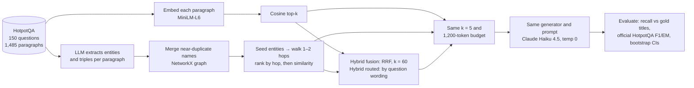
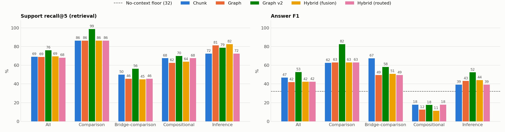
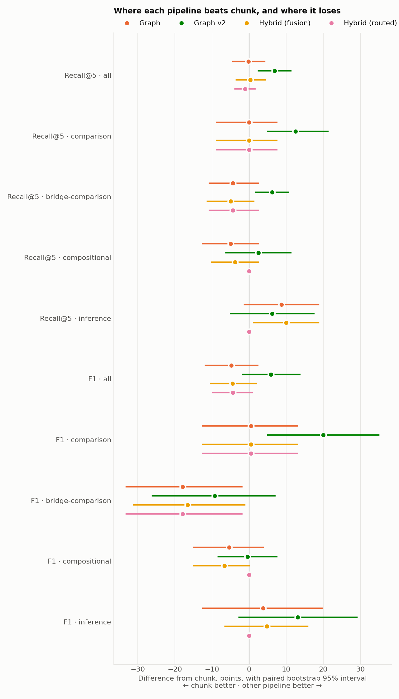

# Chunk vs Graph vs Hybrid Retrieval for Multi-Hop QA

**Question:** on multi-hop questions over a public corpus, does graph-based retrieval beat plain chunk retrieval, does a hybrid of the two beat either, and at what cost?

**Short answer, over two benchmarks (310 questions):**

- **Graph v2 is the best pipeline on both datasets.** v2 is the graph with three ranking fixes, decided before the 2Wiki test. On 2WikiMultiHopQA, which served as the held-out test, it beats chunk on recall@5 (75.9 vs 69.1, +6.9 [2.5, 11.2]) and on full support (+11.2 [3.8, 18.8]). On HotpotQA it gets full support 70.0 vs 60.0 (+10.0 [2.0, 18.0]).
- **The original graph (v1) ties chunk** on both datasets. It reaches the right evidence but ranks it out: on 2Wiki, 114 of the 142 gold paragraphs it missed were within its 2-hop walk.
- **Neither hybrid helps on held-out data.** Fusion copies the graph. The routed hybrid wins on HotpotQA, where its rule came from, and fails on 2Wiki.
- **Graph indexing is expensive:** 0.9–1.2M LLM tokens and about 40× chunk's build time, for every graph variant.

Where each one wins:

| Case | Example | Winner |
|---|---|---|
| Comparing two named things | "Which film came out first, A or B?" | **Graph v2**: 2Wiki F1 82.5 vs chunk 62.5 (+20.0 [5.0, 35.0]); HotpotQA +12.3 [1.7, 23.2] |
| Relation chain from a named person | "Who is X's paternal grandfather?" | **Graph-based**: fusion +10.0 recall [1.2, 18.8] over chunk; v1 and v2 also ahead but within noise |
| Comparing *through* a link | "Which film's director was born first, A or B?" | **Split**: v2 has the best recall (+6.2 [1.9, 10.6] over chunk), but chunk still has the best F1 (67.4 vs 58.2, within noise) |
| Bridge, second entity unnamed | "Where was the director of film X born?" | **Tie** after v2's fixes (v1 lost to chunk by 7 recall on HotpotQA) |
| Cost-sensitive, any type | — | **Chunk**: zero LLM tokens to index, and within noise of v2 on half the question types |

### HotpotQA, original graph (v1)

**Answer (n = 150):** overall the two tie. On every overall metric the 95% interval of the gap crosses zero, and the graph costs 1.2M LLM tokens and about 33× the build time to get there. The split by question type is where they differ:

- **Comparison questions:** the graph is better, at **+9.3 F1** with interval [1.7, 17.6].
- **Bridge questions:** the graph is **worse**, at **−7.0 recall@5** with interval [−13.0, −1.5] and **−5.3 F1** with interval [−10.8, −0.1].

The bridge result is the opposite of the usual "graphs help multi-hop" claim. [Failure analysis](#failure-analysis) shows why.

**Hybrid (fusion):** rank fusion of the two behaves like the graph, not like the best of both. It keeps the comparison win (**+11.3 F1** over chunk, [2.9, 20.3]) and the bridge loss (**−6.2 F1**, [−11.4, −1.6]), and it ties the graph on every metric. The two pipelines *are* complementary: a router that knew which one wins each question would reach recall 84.0 and F1 64.1, against 78.3 and 59.2 for chunk. [Why fusion misses that](#hybrid-why-fusion-follows-the-graph).


## Method



1. **Data.** 150 questions from the HotpotQA distractor validation split (100 bridge, 50 comparison), drawn with a fixed seed. The 10 context paragraphs of every question are pooled into one 1,485-paragraph corpus, so each retriever searches all of it, not just the question's own paragraphs.
2. **Chunk.** Each paragraph, with its title prepended, is embedded once with `all-MiniLM-L6-v2`. Retrieval returns the top k by cosine similarity.
3. **Graph.** Claude Haiku 4.5 extracts entities and (subject, relation, object) triples from each paragraph as JSON. Names are lowercased, and names whose embeddings are ≥ 0.95 cosine are merged. Every node and edge records the paragraphs it came from. At query time:
   - Seeds are the 5 entity nodes nearest the question by embedding, plus any entity named verbatim in the question.
   - The walk goes 2 hops out from the seeds.
   - Paragraphs are ranked by hop distance, then by similarity to the question.
4. **Hybrids.** *Fusion* is Reciprocal Rank Fusion of the full chunk ranking and the full graph ranking: each paragraph scores `1/(60 + rank)` in each list, summed. The two lists get equal weight. The constant 60 is the default from [Cormack et al. (2009)](https://plg.uwaterloo.ca/~gvcormac/cormacksigir09-rrf.pdf), not tuned here. *Routed* sends each question to one pipeline: graph if it reads as a comparison ("or", "both", "same", "in common", or a yes/no question joining two things with "and"), chunk otherwise. Both hybrids reuse both indexes, so they pay the graph's build cost.
5. **Controls.** Everything after retrieval is shared: k = 5, a 1,200-token context cap, one answer prompt, one generator at temperature 0. All of these are fixed in [`config.yaml`](config.yaml). Any gap in the table comes from retrieval.
6. **Scoring.** Retrieval is scored against HotpotQA's gold supporting-paragraph titles, so it needs no LLM judge. Answers use F1/EM ported from the [official evaluation script](https://github.com/hotpotqa/hotpot/blob/master/hotpot_evaluate_v1.py). Gaps carry paired bootstrap 95% intervals (2,000 resamples).

## HotpotQA results

| Pipeline | Recall@5 | Full support@5 | F1 all | F1 bridge | F1 comparison | EM | Index tokens | Index time | Latency |
|---|---|---|---|---|---|---|---|---|---|
| Chunk | 78.3 | 60.0 | 59.2 | 57.9 | 61.7 | 44.7 | 0 | 21 s | 117 ms |
| Graph | 75.7 | 57.3 | 58.8 | 52.7 | 71.0 | 44.7 | 1,193,425 | 680 s | 125 ms |
| Graph v2 | 82.7 | 70.0 | 64.3 | 59.5 | 74.0 | 48.7 | 1,193,425 | 652 s | 119 ms |
| Hybrid (fusion) | 76.0 | 57.3 | 58.8 | 51.7 | 73.0 | 45.3 | 1,193,425 | 701 s | 127 ms |
| Hybrid (routed) | 80.7 | 64.0 | 62.2 | 57.8 | 71.0 | 46.7 | 1,193,425 | 701 s | 119 ms |
| Graph (hub-pruned) | 75.3 | 56.7 | 58.9 | 52.8 | 71.0 | 45.3 | 1,193,425 | 680 s | 125 ms |

**No-context floor:** Haiku answering from memory scores F1 45.2 and EM 35.3. Retrieval adds about 14 F1 points over what the model already knows about Wikipedia. Recall is the headline metric because it can't be inflated by that memory.

**Oracle router:** picking the better of chunk and graph for each question, with hindsight, gives recall@5 84.0 and F1 64.1 (bridge 60.2, comparison 72.0). It is a ceiling for any chunk–graph hybrid, not a pipeline anyone can run.


- **Recall@5:** share of gold supporting paragraphs among the 5 retrieved.
- **Full support@5:** share of questions where *all* gold paragraphs were retrieved.
- **Index time:** a hybrid's is the sum of both indexes. For the graph, this is estimated as the summed API call time over 8 parallel workers, plus local graph building. The call durations are stored in the cache, so a cached re-run reports the original cost; a live run measured 591 s of wall time.
- **Latency:** median retrieval time per question, without generation. It varies by a few ms between runs.
- **Full table:** every interval is in [`results/results.md`](results/results.md). Per-question outputs are in `results/*_outputs.jsonl`.

**Hub-pruning ablation.** A natural guess for the bridge loss is hub nodes like "united states" (99 paragraphs) or "2012" (38) flooding the hop walk. The *Graph (hub-pruned)* row ignores any node attached to more than 10 paragraphs, about the 99th percentile. It changed nothing measurable, so hubs are not the cause. The row stays in the table as a negative result.

## Hybrids on HotpotQA

**Routed** is the only pipeline here that beats chunk overall: F1 +3.0 [0.5, 6.0], and +5.0 recall over the graph [1.3, 9.0]. It takes the graph's comparison win and chunk's bridge score. But its rule was written after seeing these results, so this is a description of HotpotQA, not a test. The test is the [2Wiki run](#2wikimultihopqa-results).

**Fusion** follows the graph. Fusion and graph pick the **same 5 paragraphs on 89 of 150 questions**, and fusion and chunk only on 40. Every fusion-minus-graph interval crosses zero (see [`results/results.md`](results/results.md)).

The cause is that the two rankings are not independent. Inside each hop level the graph sorts by the same question–paragraph similarity that chunk uses. So the graph's hop-0 paragraphs are usually high in the chunk list too, and they collect RRF score from *both* lists. A gold paragraph that only chunk ranks well, which is the bridge case, gets one list's score and loses: chunk rank 1 alone is worth 1/61 ≈ 0.016, while graph rank 5 plus chunk rank 30 is worth 1/65 + 1/90 ≈ 0.026.

So fusion inherits the graph's seed-precision problem instead of fixing it. The gap between chunk and the oracle router, 5.7 recall points and 4.9 F1, is what a better hybrid could recover. Candidates, which should be judged on a fresh question sample:
- **Route by question type:** graph for comparison questions, chunk otherwise. This is the *routed* row, tested on 2Wiki below.
- **Reserve slots:** fill part of the k = 5 from chunk and the rest from graph, so neither list can crowd out the other.
- **Fuse after decorrelating:** rank the graph side by hop distance only, without the similarity tie-break, so RRF isn't double-counting one signal.

## 2WikiMultiHopQA: predictions written before the run

HotpotQA can't separate the pipelines well: on 86 of 150 questions both answer correctly, and on 48 both fail. So the second benchmark is [2WikiMultiHopQA](https://github.com/Alab-NII/2wikimultihop), which labels every question with the kind of reasoning it needs. The sample is 40 questions of each type, drawn with the same seed, and pooled into one corpus as before. Every setting is unchanged.

| Type | Example | Gold paragraphs |
|---|---|---|
| comparison | Which film came out first, *Blind Shaft* or *The Mask of Fu Manchu*? | 2, both named |
| bridge-comparison | Which film has the director who was born later, *El Extraño Viaje* or *Love in Pawn*? | 4, two named |
| compositional | Who is the mother of the director of film *Polish-Russian War*? | 2, one named |
| inference | Who is Charles Bretagne Marie de La Trémoille's paternal grandfather? | 2, one named |

The routed hybrid's rule ([`is_comparison`](src/hybrid_rag.py)) was frozen before any 2Wiki question was answered. It sends comparison-style questions to the graph and the rest to chunk. It matches HotpotQA's own labels on 142 of 150 questions.

**Predictions** (recall@5 unless noted):
1. **Comparison:** graph beats chunk, as on HotpotQA.
2. **Bridge-comparison:** graph beats chunk by more. Two of the four gold paragraphs (the directors) aren't named in the question, and chunk's 5 slots go to the two films.
3. **Compositional and inference:** graph at least matches chunk. These are relation chains starting from a named entity ("director of", "father of"), which is what the graph stores. This is the opposite of HotpotQA bridge, where generic seeds sank the graph. The bet is that 2Wiki's short, relation-style paragraphs extract cleanly.
4. **Hybrid (fusion)** tracks the graph again.
5. **Hybrid (routed)** gives compositional and inference questions to chunk. If prediction 3 holds, it loses there and the HotpotQA-derived rule fails to transfer.

Results: [2WikiMultiHopQA results](#2wikimultihopqa-results).

## 2WikiMultiHopQA results



| Pipeline | Recall@5 | Full support@5 | F1 all | F1 comparison | F1 bridge-comparison | F1 compositional | F1 inference | EM | Index tokens | Index time |
|---|---|---|---|---|---|---|---|---|---|---|
| Chunk | 69.1 | 39.4 | 46.8 | 62.5 | 67.4 | 17.9 | 39.3 | 40.6 | 0 | 13 s |
| Graph | 68.9 | 41.9 | 42.0 | 63.0 | 49.4 | 12.5 | 43.1 | 34.4 | 876,405 | 523 s |
| Graph v2 | 75.9 | 50.6 | 52.6 | 82.5 | 58.2 | 17.5 | 52.4 | 46.9 | 876,405 | 500 s |
| Hybrid (fusion) | 69.4 | 43.1 | 42.3 | 63.0 | 50.8 | 11.2 | 44.1 | 34.4 | 876,405 | 536 s |
| Hybrid (routed) | 68.0 | 38.8 | 42.4 | 63.0 | 49.4 | 17.9 | 39.3 | 35.0 | 876,405 | 536 s |

No-context floor: F1 32.0. Oracle router (best of chunk and graph per question): recall 76.6, F1 56.3. With 40 questions per type, intervals are wide; every one is in [`results/2wiki/results.md`](results/2wiki/results.md).



Graph v2 is discussed in [its own section](#graph-v2-results); the analysis below is about v1, the graph the predictions were written for.

**Predictions, scored:**

| # | Prediction | Outcome |
|---|---|---|
| 1 | Graph beats chunk on comparison | **Wrong.** An exact tie (86 recall each). 2Wiki's film titles are distinctive enough for chunk to find both. |
| 2 | Graph beats chunk on bridge-comparison, by more | **Wrong, reversed.** Chunk wins F1 by **17.9** [2.0, 33.1], the largest gap in the study. |
| 3 | Graph at least matches chunk on compositional and inference | **Half right.** Inference: graph +8.8 recall, fusion +10.0 [1.2, 18.8] and +17.5 full support [2.5, 32.5]. Compositional: graph −5.0 recall, not significant. |
| 4 | Fusion tracks the graph | **Right.** Every fusion-minus-graph interval crosses zero. |
| 5 | Routed loses where it hands questions to chunk | **Right in direction, not significant** (inference −8.8 recall vs graph). The HotpotQA rule does not transfer: routed F1 42.4 vs chunk 46.8. |

**Why the graph loses bridge-comparison.** These questions name two films and need four paragraphs: both films and both directors. Chunk retrieves both named films on 33 of 40 questions; the graph on 21. Chunk answered correctly where the graph did not on 12 questions (the reverse on 3), and on 11 of those 12 the graph's context lacked one of the films, so Haiku said the film wasn't in the context. The graph fills its 5 slots with the neighbourhood of one film (its director, other films by that director) before the second film comes up. Neither pipeline ever retrieved all four paragraphs (full support 0 for both).

**Why compositional is hard for everyone.** "Where was the director of film *Summer's Blood* born?" Chunk finds the film paragraph but not the director's, whose name isn't in the question. The graph *does* link film → director, but ranks the director's paragraph too low to make the top 5. F1 is 11–18 for every pipeline, below the no-context floor.

**The common cause.** The graph missed 142 gold paragraphs on 2Wiki. **114 were inside its 2-hop walk and ranked out**, and only 28 were never reached:

| Type | Reached, ranked out | Never reached |
|---|---|---|
| comparison | 4 | 7 |
| bridge-comparison | 72 | 15 |
| compositional | 25 | 4 |
| inference | 13 | 2 |

The graph's structure holds the missing links; its ranking rule (hop-first, embedding-matched seeds) throws them away. That is the same diagnosis as HotpotQA. The fixes listed under [Failure analysis](#failure-analysis) (seeds from entity mentions, a hop penalty in place of a hard hop-first sort) were written before this run, so 2Wiki is a fair test set for them.

## Graph v2: predictions written before the run

Graph v2 ([`GraphIndexV2`](src/graph_rag.py)) applies the three fixes listed under [Failure analysis](#failure-analysis), unchanged, with one setting chosen up front (`hop_decay: 0.5`):

1. Names are merged after stripping disambiguation, so "chris wood (footballer, born 1991)" and "chris wood" become one node. The graph is rebuilt from the cached extractions, with no new LLM calls.
2. Seeds are the entities the question names, longest match first. Embedding seeds are used only when the question names none, and hubs (more than 10 paragraphs) are never seeds.
3. Paragraphs are ranked by `similarity × 0.5^hop` across all hops, in place of the hard hop-first sort.

**Predictions** (recall@5, against Graph v1):
1. v2 gains most where v1 reached gold paragraphs and ranked them out: 2Wiki bridge-comparison and compositional, and HotpotQA bridge.
2. v2 closes the gap to chunk on 2Wiki bridge-comparison, because both named films become seeds.
3. v2 keeps v1's leads on HotpotQA comparison and 2Wiki inference.

Results: [Graph v2 results](#graph-v2-results).

## Graph v2 results

| | Recall@5 | Full support@5 | F1 |
|---|---|---|---|
| **2Wiki** (held out) | | | |
| Chunk | 69.1 | 39.4 | 46.8 |
| Graph v1 | 68.9 | 41.9 | 42.0 |
| Graph v2 | **75.9** | **50.6** | **52.6** |
| v2 − chunk | +6.9 [2.5, 11.2] | +11.2 [3.8, 18.8] | +5.9 [−1.7, 13.7] |
| v2 − v1 | +7.0 [3.0, 11.1] | | +10.6 [3.5, 17.6] |
| **HotpotQA** (fixes came from its failure analysis) | | | |
| Chunk | 78.3 | 60.0 | 59.2 |
| Graph v1 | 75.7 | 57.3 | 58.8 |
| Graph v2 | **82.7** | **70.0** | **64.3** |
| v2 − chunk | +4.3 [−1.0, 9.3] | +10.0 [2.0, 18.0] | +5.2 [−0.8, 11.3] |
| v2 − v1 | +7.0 [2.3, 11.7] | | +5.6 [−0.3, 11.5] |

On 2Wiki, v2's recall gain over chunk is significant, and on both datasets so is its full-support gain. The F1 gains are about 5–6 points on each dataset, but their intervals still cross zero. HotpotQA is not a clean test for v2, because its failure analysis is where the fixes came from; 2Wiki is.

**Predictions, scored** (recall@5 vs v1):

| # | Prediction | Outcome |
|---|---|---|
| 1 | Biggest gains where v1 ranked gold out: 2Wiki bridge-comparison and compositional, HotpotQA bridge | **Mostly right.** Bridge-comparison +10.6 [5.0, 16.9] and HotpotQA bridge +8.0 [1.5, 14.5] are significant; compositional +7.5 is within noise. The largest gain was on 2Wiki comparison (+12.5), which I didn't predict. |
| 2 | v2 closes the bridge-comparison gap to chunk | **Right on recall, partly on F1.** Recall went from −4.4 to +6.2 [1.9, 10.6] over chunk. The F1 gap halved, from −17.9 (significant) to −9.2 (within noise). |
| 3 | v2 keeps v1's leads on HotpotQA comparison and 2Wiki inference | **Right.** HotpotQA comparison grew (+11.0 recall over chunk, [4.0, 18.0]). 2Wiki inference is −2.5 vs v1, within noise. |

**What changed in practice.** Named entities become the seeds, so both films in a comparison question start at hop 0: v2 retrieves both named films on 39 of 40 bridge-comparison questions, against 21 for v1 and 33 for chunk. Its F1 there still trails chunk's (within noise), so having both films is not enough without their directors. With the hop penalty, a directly relevant hop-1 paragraph can now outrank a weakly related hop-0 one. On 2Wiki comparison, recall went from 86 to 99.

**What it still doesn't fix.** Compositional F1 is still 17.5, as low as chunk's: "Where was the director of film X born?" needs the director's paragraph, and at `0.5^hop` it still often ranks below the film's other neighbours. Bridge-comparison needs four paragraphs, and full support there is still almost zero for every pipeline at k = 5.

## Failure analysis

**Why graph loses on bridge questions.** Across the 100 bridge questions, the graph missed 64 gold paragraphs:

| Cause | Missed gold paragraphs |
|---|---|
| Reached by the walk, but outranked by other paragraphs (16 of them at hop 0) | 45 |
| Never reached within 2 hops | 19 |

When a gold paragraph is missed, the seeds have pulled in a median of 10 hop-0 paragraphs. Five embedding-matched seeds include generic nodes such as "cloning" or "american rock band", and their paragraphs fill all 5 slots before hop 1 is considered. **The bottleneck is seed precision and the ranking rule, not the graph's reach.**

### Graph pipeline

1. **"Clone of clones played alongside a band from where?"** Gold is *Cleveland, Ohio*; the graph pipeline answered *Washington, D.C.* The bridge paragraph *SomeKindaWonderful* was reached at hop 1. But seeds like "cloning", "american rock band" and "universal music group" put 6 paragraphs at hop 0, so it never made the top 5, and the model answered with the city of a band that was in the context.
2. **"When was the club formed, for which Adam Johnson played as well as Middlesbrough and Watford?"** Gold is *1919*; it answered *1881*. This is a **bad merge**: Johnson's paragraph produced the entity "leeds united", while the Leeds paragraph's title entity is "leeds united f.c". At 0.95 cosine they stayed separate nodes, so the walk never reached Leeds. The model then answered with the founding year of Watford, which was in the context.
3. **"Hamilton Wanderers AFC has a former player that is vice captain for what team?"** Gold is the *New Zealand national team*; it answered *Sydney FC*. This is the same failure: "chris wood" (from the club's paragraph) and "chris wood (footballer, born 1991)" (his title) were never merged. The second hop does not exist in the graph, even though the extraction found both facts.

### Chunk pipeline

1. **"Are Even and Incubus known for their skill in classical music?"** Gold is *no*; it answered *No information provided*. A **distractor was ranked first**: the most embeddable phrase in the question is "classical music", so four of five slots went to classical-music paragraphs and neither band was retrieved. The graph seeds on the band names verbatim and gets it right.
2. **"Who was born first, Vladimir Nabokov or Harper Lee?"** Gold is *Vladimir Nabokov*; it answered *Cannot determine from context*. **One entity crowded out the other**: four of five slots went to Nabokov-related paragraphs (his works, a story collection), and Harper Lee was never retrieved. This is why the graph wins on comparison questions.
3. **"Phyllis Kohn holds a seat in the House of Representatives which meets where?"** Gold is *Saint Paul*. Here the context was right and the answer was wrong: both gold paragraphs were retrieved, but the question misspells "Kahn". The model refused to bridge the typo and explained why, scoring 0 F1. This happens with both pipelines: Haiku sometimes answers "the context does not provide…" despite a prompt telling it to always give its best short answer.

**What would fix the graph (not done here, to avoid tuning on the test set):**
- Normalise entity names by stripping disambiguation suffixes like "(footballer, born 1991)" and "f.c." before merging.
- Pick seeds by entity mentions in the question rather than by nearest embedding.
- Rank across hops by similarity, with a hop penalty instead of a hard hop-first sort.

All three should be judged on a fresh question sample, not these 150.

## Reproduce

Requires Docker and an Anthropic API key.

```bash
cp .env.example .env                                     # put ANTHROPIC_API_KEY in .env
docker compose build
docker compose run --rm bench python run.py --limit 20   # quick check on 20 questions
docker compose run --rm bench python run.py              # full run -> results/
docker compose run --rm bench python run.py --dataset 2wiki   # -> results/2wiki/
```

Every LLM call is cached in [`cache/llm/`](cache/llm), keyed by a hash of the full request. The cache is committed, so **a clean clone reproduces every number and chart above without calling the API**; the key is only needed for new calls.

- `--chunk-only` gives the chunk retrieval numbers with no LLM at all.
- Partial runs (`--limit`, `--chunk-only`) write to `results/dev/` and never overwrite the real table.
- The frozen data in `data/` was built by `data/build_data.py`. It never resamples unless run with `--force`.

To use a local model instead of the API, set `llm_provider: ollama` and `llm_model: qwen2.5:3b-instruct` in `config.yaml`, then run `docker compose up -d ollama`. Without the cache that path runs on CPU inside Docker on a Mac, and the full benchmark takes hours.

## Layout

| Path | Contents |
|---|---|
| [`run.py`](run.py) | One entry point: build indexes, answer, evaluate, plot |
| [`config.yaml`](config.yaml) | Models, k, token budget, seed, graph settings |
| [`data/`](data) | Frozen HotpotQA `questions.jsonl` and `corpus.jsonl`, and the script that built them |
| [`data/2wiki/`](data/2wiki) | Frozen 2WikiMultiHopQA sample, built by [`data/build_2wiki.py`](data/build_2wiki.py) |
| [`src/common.py`](src/common.py) | Config, data loading, embedder, context budget |
| [`src/chunk_rag.py`](src/chunk_rag.py) | Embedding index and top-k retrieval |
| [`src/graph_build.py`](src/graph_build.py) | Extraction prompt, entity merging, graph construction |
| [`src/graph_rag.py`](src/graph_rag.py) | Seed matching, hop expansion, ranking, hub pruning; Graph v2 |
| [`src/hybrid_rag.py`](src/hybrid_rag.py) | Fusion (RRF) and routed hybrids, and the routing rule |
| [`src/generate.py`](src/generate.py) | Shared answer prompt, LLM call with disk cache |
| [`src/evaluate.py`](src/evaluate.py) | Official HotpotQA F1/EM, retrieval metrics, bootstrap |
| [`src/plots.py`](src/plots.py) | The three charts in this README |
| [`results/`](results) | HotpotQA table, charts, per-question outputs |
| [`results/2wiki/`](results/2wiki) | The same for 2WikiMultiHopQA |

## Limitations

- **Sample size.** 150 HotpotQA and 160 2Wiki questions; per-type 2Wiki results rest on 40 questions each. Gaps under about 8 points overall, or 15 per 2Wiki type, are within noise; the intervals say which results hold.
- **Two graph designs.** v1 and v2 share one extraction; only naming and ranking differ, and v2's single setting (`hop_decay: 0.5`) was fixed before it ran. The hybrids are built on v1; a v2-based hybrid is untested.
- **Same questions throughout.** The failure analysis, the hub ablation and the hybrid analysis used the same 150 questions as the headline numbers. No setting was tuned to raise a score, but a follow-up should confirm on a new sample.
- **One extraction model.** Haiku's extraction quality and the simple name-merging rule cap the graph pipeline (see the bad-merge cases above).
- **Model memory.** Haiku already knows much of Wikipedia; the no-context floor shows how much.
- **Approximate token budget.** It is a word-count estimate, applied identically to both pipelines.

## Data and license

HotpotQA (Yang et al., 2018, [hotpotqa.github.io](https://hotpotqa.github.io/)), distractor setting, via [Hugging Face](https://huggingface.co/datasets/hotpotqa/hotpot_qa). It is licensed CC BY-SA 4.0, and the HotpotQA files in `data/` are shared under the same license.

2WikiMultiHopQA (Ho et al., 2020, [github.com/Alab-NII/2wikimultihop](https://github.com/Alab-NII/2wikimultihop)), dev split, via the [`framolfese/2WikiMultihopQA`](https://huggingface.co/datasets/framolfese/2WikiMultihopQA) mirror pinned to revision `fe713bf`. It is licensed Apache 2.0, and `data/2wiki/` is shared under the same license.
