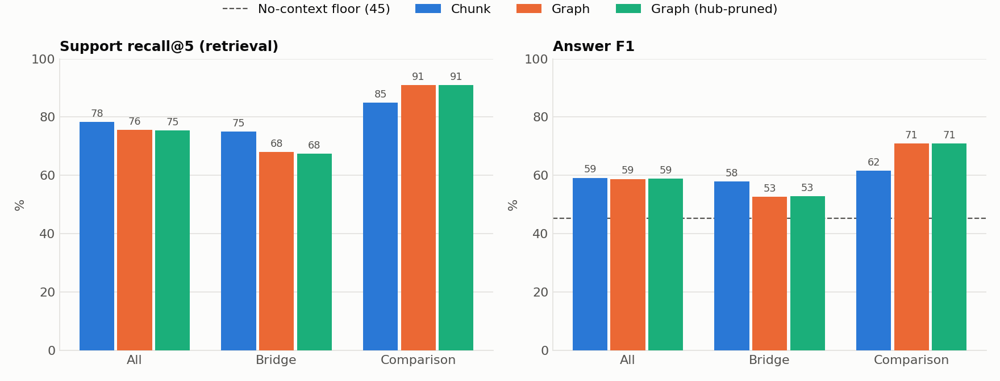
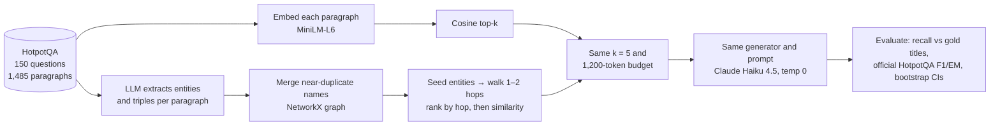
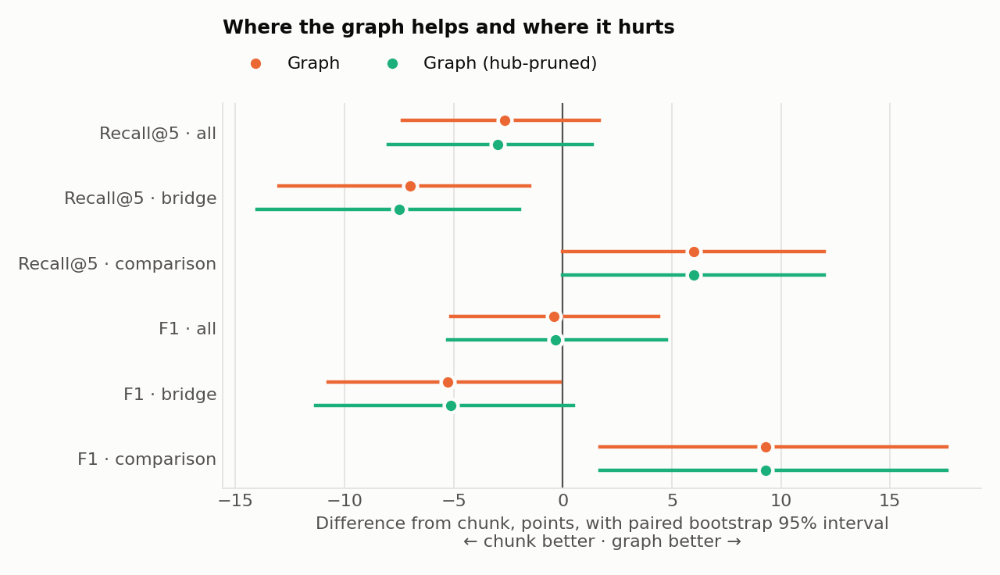
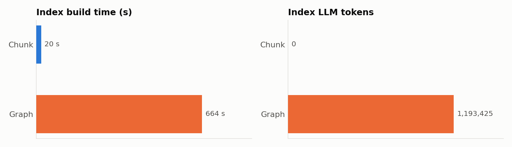

# Chunk vs Graph Retrieval on HotpotQA

**Question:** on multi-hop questions over a public corpus, does graph-based retrieval beat plain chunk retrieval, and at what cost?

**Answer (n = 150):** overall the two tie. On every overall metric the 95% interval of the gap crosses zero, and the graph costs 1.2M LLM tokens and about 33× the build time to get there. The split by question type is where they differ:

- **Comparison questions:** the graph is better, at **+9.3 F1** with interval [1.7, 17.6].
- **Bridge questions:** the graph is **worse**, at **−7.0 recall@5** with interval [−13.0, −1.5] and **−5.3 F1** with interval [−10.8, −0.1].

The bridge result is the opposite of the usual "graphs help multi-hop" claim. [Failure analysis](#failure-analysis) shows why.



## Method



1. **Data.** 150 questions from the HotpotQA distractor validation split (100 bridge, 50 comparison), drawn with a fixed seed. The 10 context paragraphs of every question are pooled into one 1,485-paragraph corpus, so each retriever searches all of it, not just the question's own paragraphs.
2. **Chunk.** Each paragraph, with its title prepended, is embedded once with `all-MiniLM-L6-v2`. Retrieval returns the top k by cosine similarity.
3. **Graph.** Claude Haiku 4.5 extracts entities and (subject, relation, object) triples from each paragraph as JSON. Names are lowercased, and names whose embeddings are ≥ 0.95 cosine are merged. Every node and edge records the paragraphs it came from. At query time:
   - Seeds are the 5 entity nodes nearest the question by embedding, plus any entity named verbatim in the question.
   - The walk goes 2 hops out from the seeds.
   - Paragraphs are ranked by hop distance, then by similarity to the question.
4. **Controls.** Everything after retrieval is shared: k = 5, a 1,200-token context cap, one answer prompt, one generator at temperature 0. All of these are fixed in [`config.yaml`](config.yaml). Any gap in the table comes from retrieval.
5. **Scoring.** Retrieval is scored against HotpotQA's gold supporting-paragraph titles, so it needs no LLM judge. Answers use F1/EM ported from the [official evaluation script](https://github.com/hotpotqa/hotpot/blob/master/hotpot_evaluate_v1.py). Gaps carry paired bootstrap 95% intervals (2,000 resamples).

## Results

| Pipeline | Recall@5 | Full support@5 | F1 all | F1 bridge | F1 comparison | EM | Index tokens | Index time | Latency |
|---|---|---|---|---|---|---|---|---|---|
| Chunk | 78.3 | 60.0 | 59.2 | 57.9 | 61.7 | 44.7 | 0 | 20 s | 113 ms |
| Graph | 75.7 | 57.3 | 58.8 | 52.7 | 71.0 | 44.7 | 1,193,425 | 664 s | 120 ms |
| Graph (hub-pruned) | 75.3 | 56.7 | 58.9 | 52.8 | 71.0 | 45.3 | 1,193,425 | 664 s | 118 ms |

**No-context floor:** Haiku answering from memory scores F1 45.2 and EM 35.3. Retrieval adds about 14 F1 points over what the model already knows about Wikipedia. Recall is the headline metric because it can't be inflated by that memory.





- **Recall@5:** share of gold supporting paragraphs among the 5 retrieved.
- **Full support@5:** share of questions where *all* gold paragraphs were retrieved.
- **Index time:** for the graph, this is estimated as the summed API call time over 8 parallel workers, plus local graph building. The call durations are stored in the cache, so a cached re-run reports the original cost; a live run measured 591 s of wall time.
- **Latency:** median retrieval time per question, without generation. It varies by a few ms between runs.
- **Full table:** every interval is in [`results/results.md`](results/results.md). Per-question outputs are in `results/*_outputs.jsonl`.

**Hub-pruning ablation.** A natural guess for the bridge loss is hub nodes like "united states" (99 paragraphs) or "2012" (38) flooding the hop walk. The *Graph (hub-pruned)* row ignores any node attached to more than 10 paragraphs, about the 99th percentile. It changed nothing measurable, so hubs are not the cause. The row stays in the table as a negative result.

## Failure analysis

**Why graph loses on bridge questions.** Across the 100 bridge questions, the graph missed 64 gold paragraphs:

| Cause | Missed gold paragraphs |
|---|---|
| Reached by the walk, but outranked by other paragraphs (16 of them at hop 0) | 45 |
| Never reached within 2 hops | 19 |

When a gold paragraph is missed, the seeds have pulled in a median of 10 hop-0 paragraphs. Five embedding-matched seeds include generic nodes such as "cloning" or "american rock band", and their paragraphs fill all 5 slots before hop 1 is considered. **The bottleneck is seed precision and the ranking rule, not the graph's reach.**

### Graph pipeline

1. **"Clone of clones played alongside a band from where?"** Gold is *Cleveland, Ohio*; the graph pipeline answered *Washington, D.C.* The bridge paragraph *SomeKindaWonderful* was reached at hop 1. But seeds like "cloning", "american rock band" and "universal music group" put 6 paragraphs at hop 0, so it never made the top 5, and the model answered with the city of a band that was in the context.
2. **"When was the club formed, for which Adam Johnson played as well as Middlesbrough and Watford?"** Gold is *1919*; it answered *1881*. This is a **bad merge**: Johnson's paragraph produced the entity "leeds united", while the Leeds paragraph's title entity is "leeds united f.c". At 0.95 cosine they stayed separate nodes, so the walk never reached Leeds. The model then answered with the founding year of Watford, which was in the context.
3. **"Hamilton Wanderers AFC has a former player that is vice captain for what team?"** Gold is the *New Zealand national team*; it answered *Sydney FC*. This is the same failure: "chris wood" (from the club's paragraph) and "chris wood (footballer, born 1991)" (his title) were never merged. The second hop does not exist in the graph, even though the extraction found both facts.

### Chunk pipeline

1. **"Are Even and Incubus known for their skill in classical music?"** Gold is *no*; it answered *No information provided*. A **distractor was ranked first**: the most embeddable phrase in the question is "classical music", so four of five slots went to classical-music paragraphs and neither band was retrieved. The graph seeds on the band names verbatim and gets it right.
2. **"Who was born first, Vladimir Nabokov or Harper Lee?"** Gold is *Vladimir Nabokov*; it answered *Cannot determine from context*. **One entity crowded out the other**: four of five slots went to Nabokov-related paragraphs (his works, a story collection), and Harper Lee was never retrieved. This is why the graph wins on comparison questions.
3. **"Phyllis Kohn holds a seat in the House of Representatives which meets where?"** Gold is *Saint Paul*. Here the context was right and the answer was wrong: both gold paragraphs were retrieved, but the question misspells "Kahn". The model refused to bridge the typo and explained why, scoring 0 F1. This happens with both pipelines: Haiku sometimes answers "the context does not provide…" despite a prompt telling it to always give its best short answer.

**What would fix the graph (not done here, to avoid tuning on the test set):**
- Normalise entity names by stripping disambiguation suffixes like "(footballer, born 1991)" and "f.c." before merging.
- Pick seeds by entity mentions in the question rather than by nearest embedding.
- Rank across hops by similarity, with a hop penalty instead of a hard hop-first sort.

All three should be judged on a fresh question sample, not these 150.

## Reproduce

Requires Docker and an Anthropic API key.

```bash
cp .env.example .env                                     # put ANTHROPIC_API_KEY in .env
docker compose build
docker compose run --rm bench python run.py --limit 20   # quick check on 20 questions
docker compose run --rm bench python run.py              # full run -> results/
```

Every LLM call is cached in [`cache/llm/`](cache/llm), keyed by a hash of the full request. The cache is committed, so **a clean clone reproduces every number and chart above without calling the API**; the key is only needed for new calls.

- `--chunk-only` gives the chunk retrieval numbers with no LLM at all.
- Partial runs (`--limit`, `--chunk-only`) write to `results/dev/` and never overwrite the real table.
- The frozen data in `data/` was built by `data/build_data.py`. It never resamples unless run with `--force`.

To use a local model instead of the API, set `llm_provider: ollama` and `llm_model: qwen2.5:3b-instruct` in `config.yaml`, then run `docker compose up -d ollama`. Without the cache that path runs on CPU inside Docker on a Mac, and the full benchmark takes hours.

## Layout

| Path | Contents |
|---|---|
| [`run.py`](run.py) | One entry point: build indexes, answer, evaluate, plot |
| [`config.yaml`](config.yaml) | Models, k, token budget, seed, graph settings |
| [`data/`](data) | Frozen `questions.jsonl` and `corpus.jsonl`, and the script that built them |
| [`src/common.py`](src/common.py) | Config, data loading, embedder, context budget |
| [`src/chunk_rag.py`](src/chunk_rag.py) | Embedding index and top-k retrieval |
| [`src/graph_build.py`](src/graph_build.py) | Extraction prompt, entity merging, graph construction |
| [`src/graph_rag.py`](src/graph_rag.py) | Seed matching, hop expansion, ranking, hub pruning |
| [`src/generate.py`](src/generate.py) | Shared answer prompt, LLM call with disk cache |
| [`src/evaluate.py`](src/evaluate.py) | Official HotpotQA F1/EM, retrieval metrics, bootstrap |
| [`src/plots.py`](src/plots.py) | The three charts in this README |
| [`results/`](results) | Final table, charts, per-question outputs |

## Limitations

- **150 questions.** Gaps under about 8 points are within noise; the intervals say which results hold.
- **Same questions throughout.** The failure analysis and the hub ablation used the same 150 questions as the headline numbers. No setting was tuned to raise a score, but a follow-up should confirm on a new sample.
- **One extraction model.** Haiku's extraction quality and the simple name-merging rule cap the graph pipeline (see the bad-merge cases above).
- **Model memory.** Haiku already knows much of Wikipedia; the no-context floor shows how much.
- **Approximate token budget.** It is a word-count estimate, applied identically to both pipelines.

## Data and license

HotpotQA (Yang et al., 2018, [hotpotqa.github.io](https://hotpotqa.github.io/)), distractor setting, via [Hugging Face](https://huggingface.co/datasets/hotpotqa/hotpot_qa). It is licensed CC BY-SA 4.0, and the data files in `data/` are shared under the same license.
